# ECE445 Lab Notebook

## WEEK 1 — 2/9
1. Completed the CAD soldering assignment
2. Had first meeting with TA discussing project scope and how exactly the sensors work
3. Researched MAX86141 and SFH-7050A to see how the chips function
4. Wrote up the proposal

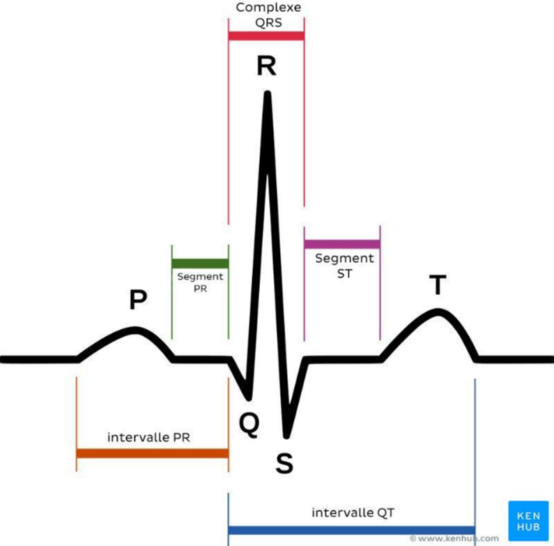

## WEEK 2 — 2/16
1. Started a course in nRF Connect SDK online, learning to code via Nordic Semiconductor
2. Wrote up the team contract
3. Preparing both PCBs for reviews, working on the schematic
4. Preparing for breadboard demo — finding a way to show the circuit

## WEEK 3 — 2/23
1. Wrote the design document for the whole week
2. Finished up schematics with teammates and got it checked by TA
3. Started editing board layout and assigning footprints to all chips
4. First round of ECG board completed and ordered
5. Designed breakout boards since PPG board will not arrive in time

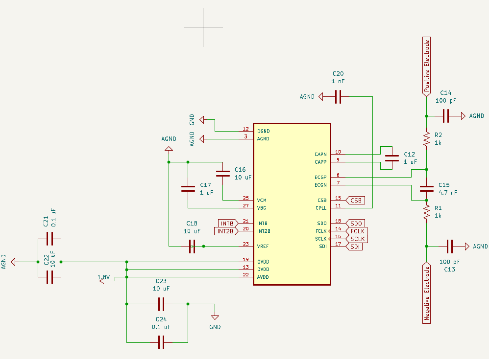

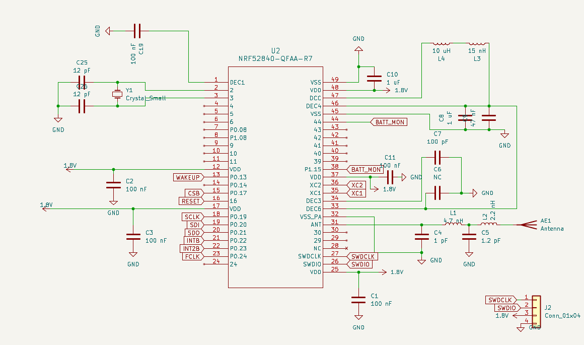

## WEEK 4 — 3/2
1. Prepared for design review, ironed out remaining details
2. Tested ECG sensor to prepare for breadboard demo
3. Breakout boards didn't arrive in time — pivoted to ECG sensor that did arrive
4. Tested ECG using a waveform generator connected via MATLAB

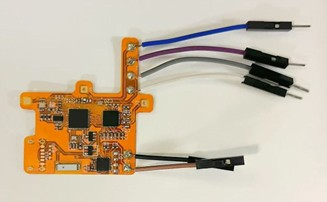

## WEEK 5 — 3/9
1. Completed teamwork evaluation
2. Began finding alternative connection methods using VSCode
3. Ordered redesigned PPG sensor board — consolidated two PPG sensors onto one board using a single NRF52840
4. Continuing to learn firmware software

## WEEK 6 — 3/16
1. Spring break — finished nRF Connect SDK online course
2. Double-checked ECG schematics
3. Changed PPG sensor design: added long serpentine traces to keep photodiode resistors near earlobes, making the PCB more flexible and wearable

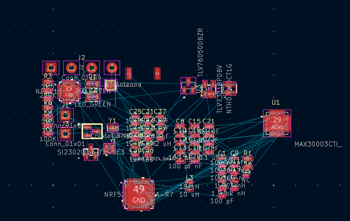

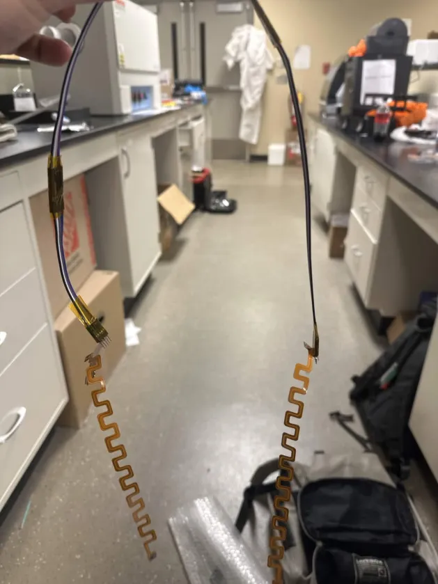

## WEEK 7 — 3/23
1. Prepared for progress demo — tested PPG sensor using a flashlight to show peaks on phone app
2. Continuing daily testing trying to implement full software working with finger measurements

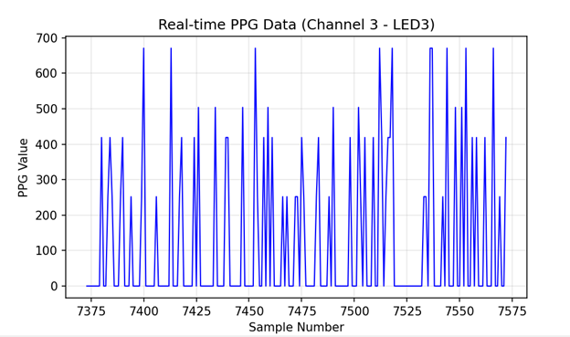

## WEEK 8 — 3/30
1. Finger measurements showing too much noise on the plot — performing root cause analysis
2. Connected PPG via phone app for the progress demo

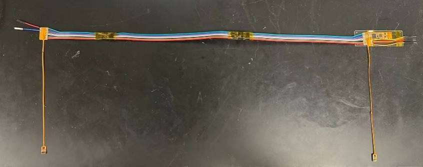

## WEEK 9 — 4/6
1. Progress demo completed — showed PPG working with flashlight to demonstrate waveform peaks
2. Testing revealed that the long serpentine traces and placing MAX86141 far from the photodiode were likely causing the large noise readings
3. Redesigned a new board removing the serpentine traces (deadline had passed but submitted anyway)
4. Added software filters which made the flashlight signal clear but finger readings still showed no valid values
5. Main suspected issue: incorrect potential difference supplied to the photodiode

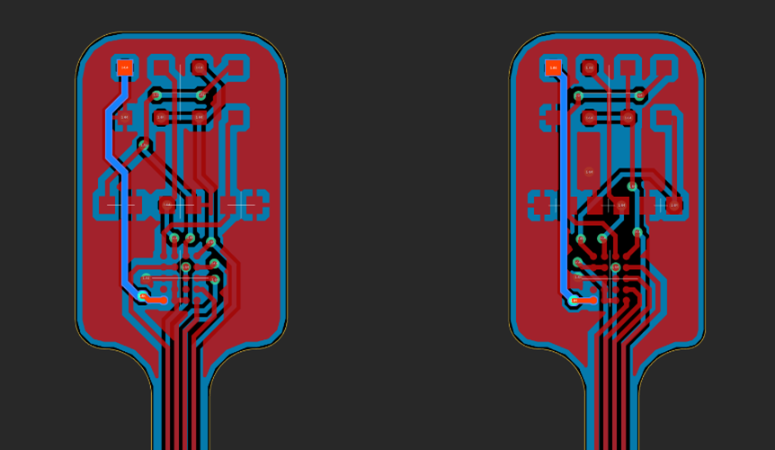

## WEEK 10 — 4/13
1. Encountering major noise on all PPG pulse readings
2. Tested outside the lab to rule out lab socket interference — no improvement
3. Waiting for newly designed PCB; continuing to validate software on old iteration
4. Fixed entire MAX86141 config file — register values were all incorrect

## WEEK 11 — 4/20
1. Prepared mock presentation slideshow
2. Mock demo with TA Shiyuan — demonstrated ECG sensor
3. New PPG board delivered, soldering completed, conducted testing over the weekend
4. PPG still not working — LEDs on the photodiode not lighting up, out of debugging ideas
5. ECG sensor working perfectly — began encapsulating it

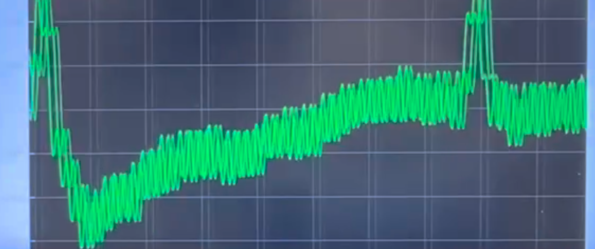

## WEEK 12 — 4/27
1. Final demo completed
2. Prepared second mock presentation for TA on Thursday
3. Attempted last-minute PPG fixes through Monday — unsuccessful
4. Encapsulated the complete ECG sensor with foam and connected pin-up electrodes
5. Final presentation ready for next week
6. Working on final paper and lab notebook
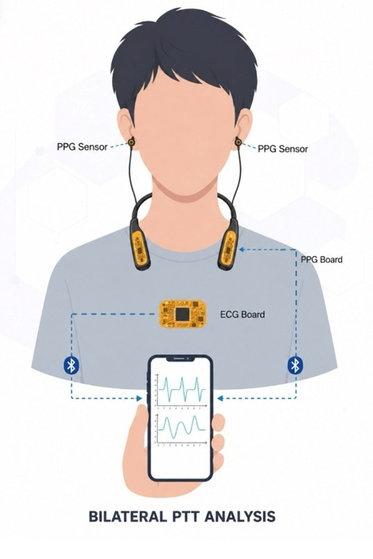
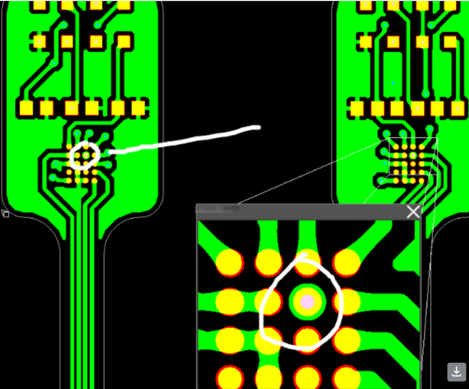
